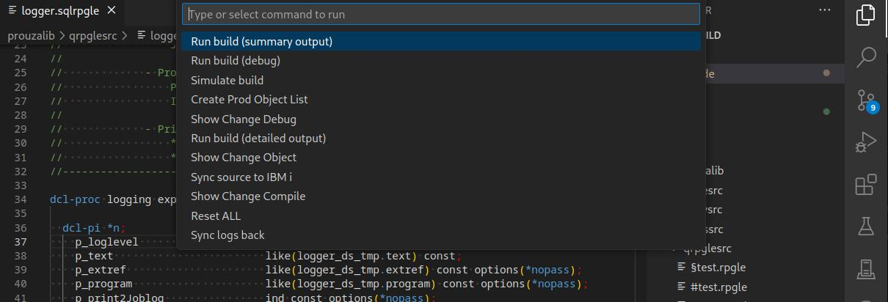
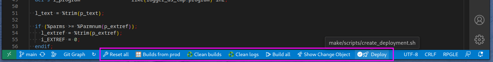
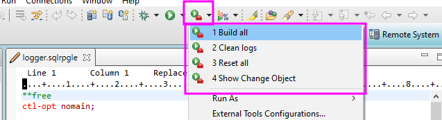
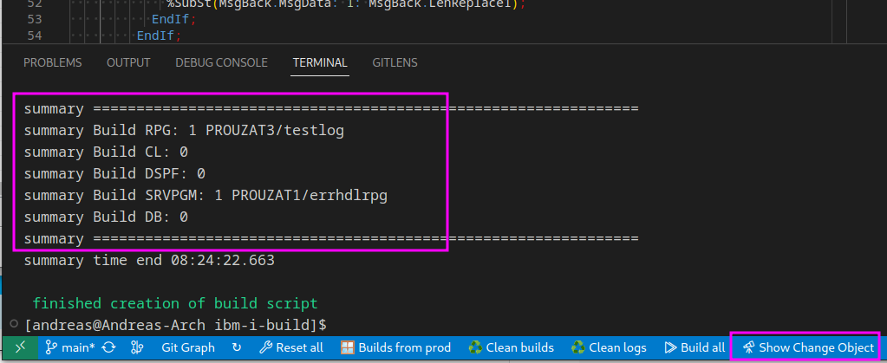
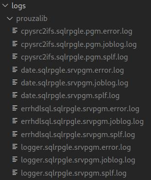
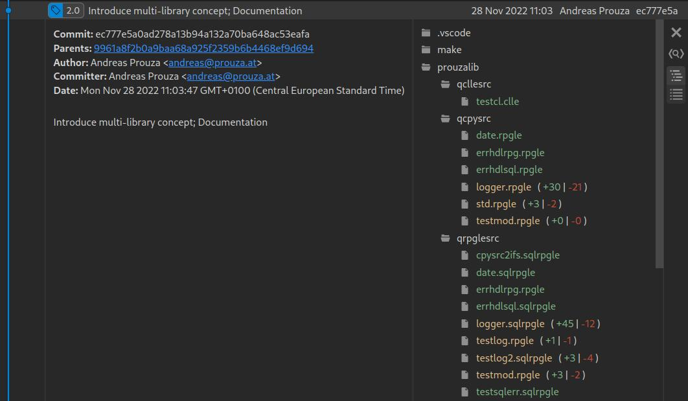
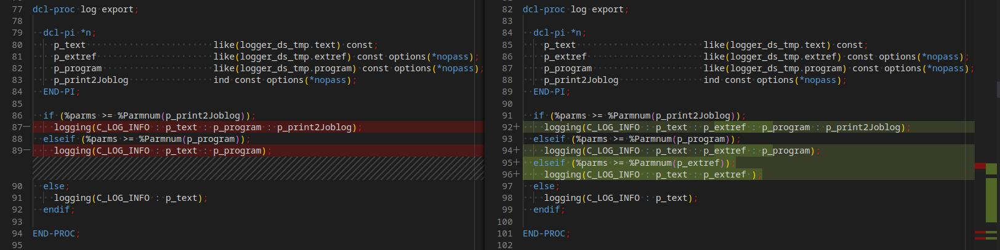

# Documentation

- [Overview](/docs/pages/overview.md)
- [Quick Start](/docs/pages/quick_start.md)
- [SSH](/docs/pages/SSH.md)
- [GNU Make](/docs/pages/gnu_make.md)
- [GIT notes](/docs/pages/git.md)
- [Integration in your IDE](/docs/pages/integration_in_your_ide.md)
- [FAQ](/docs/pages/faq.md)

# 

**This project should help to make our deployment process automated:**

## Features
* Check for changes
  
    It checks all sources which have changed since last compilie
  
* Check for dependencies
  
  All objects which depend on the changed source will also be compiled (in correct order)

  E.g. if a table or view has changed, all objects which use them will be compiled too

  For details have a look at [Set up your Makefile(s)](/docs/pages/gnu_make.md#set-up-your-makefiles)

* Compile in correct order
  
  tables before programs etc. based on the dependency list

* All actions can be done in you IDE (RDi or vscode)
  * Using short cuts

    
  
  * Or action buttons

    

    

  * You can also see which objects would be compiled in which target lib:
    
    

* Logging
  
  All compile informations separated by each source: 
  * joblog
  * spool file
  * error output

  

**If you also want to use git with that you will benefit of all it advantages:**

* Work with branches
* Version control

  

* Integration in other tools like Atlassian JIRA
* Compare between different versions

  

