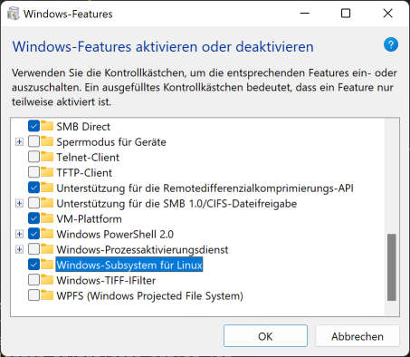
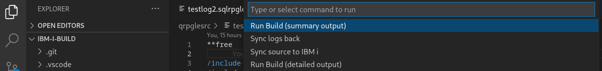

# Overview

My DevOps concept includes multiple components like GIT as a basis for source management.

In this example I focus on the build part of the DevOps concept.

For all IBM i builds I use 2 components:

* GNU Make
  
  Build you source

  * In correct order
  * Consider dependencies (PF/LF/DSPF --> RPG)
  
* VSCode or RDi with RSYNC
  
  To synchronise your sources to the build server (IBM i)

# SSH
Sicne we use the SSH protocoll to communicate with IBM i we need:
* SSH Deamon is up and running

    ```STRTCPSVR *SSHD```

* The open source package manager (YUM) is installed on IBM i

    You can do this in ACS

* Recommended: BASH is installed and set to your profile
    
    In shell:
    ```sh
    yum install bash
    ```
    SQL:
    ```sql
    CALL QSYS2.SET_PASE_SHELL_INFO('*CURRENT', '/QOpenSys/pkgs/bin/bash');
    ```

* Define ```~/.profile``` file:
  
    ```sh
    export PATH="/QOpenSys/pkgs/bin:$PATH"
    ```
    This is neseccary to have the correct ```PATH``` in the IBM i shell.

* Use key authentication
  
    ```sh
    ssh-keygen -b 4096
    # Enter your key name full qualified (e.g. /home/prouza/.ssh/academy_rsa)
    # Then you will be asked for a password. If you set one, you will be asked for it on each Login. If not you will be logged in without any prompt.
    ```

    * Linux
  
        On Linux you can simple use ```ssh-copy-id``` to copy the public key to your remote system.
        ```sh
        ssh-copy-id -i ~/.ssh/academy_rsa prouza@academy
        ```

    * Windows
    
        Copy the content of the generated public key (e.g. ```academy_rsa.pub```) on the remote system to the file ```~/.ssh/authorized_keys```. (You also need to create the directory if not exist.)<br/>
        Be aware that the directory ```.ssh``` and the file ```authorized_keys``` are not allowed to be readable by anyone except of you.

        ```sh
        chmod 600 .ssh/authorized_keys
        ```


    On your local machine create the ```~/.ssh/config``` file (and directory) if not exist and add the following:

    ```
    Host academy
    HostName academy
    IdentitiesOnly=yes
    User prouza
    IdentityFile ~/.ssh/academy_rsa
    ```

    Now you should be able to login without a prompt: 
    ```ssh
    [andreas@Andreas-Linux ~]$ ssh academy 
    -bash-5.1$ 
    ```

  * Most problems here are
    * Home directory does not exist
    * Home directory does not match with user profile name
    * Owner of home directory is someone else
    * Permission of the home directory is not strict enough

# GNU Make

## Installation

You can install ist via ACS OpenSource-Package-Mangager or via YUM in the console
```sh
yum install git

===================================================================
 Package        Arch          Version       Repository        Size
===================================================================
Installing:
 make-gnu       ppc64         4.2-2         ibmi-base        520 k
```

## Set up our Makefile(s)

```make``` uses ```makefile```s in which the plan is set up how to build your application.

For more details about makefiles you can find a lot of stuff in the internet.

I split it up into 5 makefiles

1. makefile

    The basic config file to start the build (source location in IFS, target lib)

2. env.mk

    This I use to define search paths and environment variables

3. .makeprofile.mk

    This file shouldn't be synchronised to the GIT project since this is individually for each user.<br/>
    If you are using GIT (and you should), this files is in the ```.gitignore``` list.<br/>
    Here you can overwrite for example the source directory to you own working directory in the IFS.

    If you are not using GIT and you only have one directory where all developers are working with, you can just delete the ```.makeprofile.mk``` file.

4. objecte_list.mk

    A list of all objects and their dependencies.<br/>
    First all objects are stored in a variable with a blank as separator.

    Then all objects with dependencies are listed including all dependiencies which ```make``` should consider.<br/>
    You can find a detailed description in this file.

5. make_compile_rules.mk

    For all type of objects you want to create the build command needs to be defined here (RPG, CL, DSPF, SQL Tables, ...)<br/>
    I already set up the compile rules, so it should be able to handle most of your (ILE) builds.<br/>
    If you also want to build objects like menues or printer files, you can simple add the command at the end of this file.

## Run GNU Make

### Build directories
This Makefiles uses 2 directories in the IFS for the build output

* build
  
    For each compiled/created object a dummy file will be created in the ```build```.<br/>
    The creation timestamp of these files will be used to compare it with the last changed timestamp of the source of the object.<br/>
    If the source is yunger then the compile process of the object will be started.<br/>
    Otherwise it will be ignored.

* logs

    Contains compile output: spooled files and job log

### Preperation

If you don't want to build all from scretch but only build changed sources, you can use the following:
```sh
gmake init # to create all necessary directories for build
gmake all --touch --directory=build --makefile=/home/prouza/myproject/makefile
```
This only creates the dummy build object files in the ```build``` directory.

### Run build

After all this is done you can use ```gmake``` to build you applications.
```sh
gmake all
```


## Summary

1. Install GNU Make on IBM i
2. Create a project directory in you working IFS path (e.g. /home/prouza/myproject)
3. Copy all sources into this directory.<br/>
All source files are subdirectories (e.g. /home/prouza/myproject/qrpglesrc/logtest.rpgle)
4. Copy all make-config-files
5. Modify the makefiles to your own settings
   * makefile
     * IFS Path
     * Target lib (PGM & DB)
     * ACTGRP
     * LIBLIST
   * object_list.mk
     * If you want to add additional objects to be build
   * .makeprofile.mk
     * If you want to override some settings for your own environment
6. Open a terminal (QSH, Putty, ...)
7. Make sure you have the ```$PATH``` variable set correct (```/QOpenSys/pkgs/bin``` needs to be in the list)<br/>
I also use ```BASH``` as shell. It makes life much easier.
8. Go into your directory

    ```sh
    cd /home/prouza/myproject
    ```
9.  Run the build

    ```sh
    gmake all
    ```


# Integration in your IDE

## VSCode
You should have installed the ```Code for IBM i``` extension.

With this you can work with your sources directly in the IFS of your IBM i.

If you use GIT I recommend to install the ```Git Graph``` extension.

## VSCode & RSYNC

After our project was set up successfully we can now focus on our favourite IDE.

In both IDEs you can use external commands like ```rsync``` to automatically synchronise your code with your working directory in the IFS.<br/>
You can set up in both IDEs (RDi and VSCode) to do this automatically after saving your changes in the source.

### Prerequisites
You need to install ```rsync``` on your local machine and on IBM i.

#### IBM i
```sh
yum install rsync
```

#### Linux
On Linux this is very easy. It only depends which package manager you are using:
```sh
yum install rsync
```
```sh
apt-get install rsync
```
```sh
pacman -S rsync
```

Rename the ```settings.json - for linux``` to ```settings.json``` to get the Linux settings.

#### Windows
```rsync``` is a Unix based utility. So you can't just easily install it on Windows.

I did this job by using WSL (Windows Subsystem for Linux).

1. Open the "Turn Windows features on or off"
2. Choose "Windows Subsystem for Linux" and select "OK"
   
    

3. Open the Microsoft Store and search for "Linux Ubuntu" and install it
   
    

4. After installing the Linux distribution "Launch" it.
   
   The first time you may will be asked to set up a user/password for this environment.


You can also do this via PowerShell. You will find a good documentation in the internet for this process if you want to do it in that way.

After this is done you can use ```rsync``` using WSL in the Windows CMD:
```sh
wsl rsync ...
```

Rename the ```settings.json - for windows``` to ```settings.json``` to get the Windows settings.


### VSCode extensions

Therefore I am using 2 extensions:

* Run on Save
  
    Automatically sync when source is saved.<br/>
    So no need to do some extra sync.
* Command Runner
  
    To trigger the sync manually (e.g. if I switch branch) using:<br/> 
    STRG+P --> Select: Run Command --> Select: Run Build (summary output)

You can just use the ```.vscode/settings.json``` from this project.<br/>
Don't forget to change hostname and user.


### Let's run the build
Use STRG+P. When you start typing "run command" you should get correct list to select the "Run Command" extension.


Now you will get a list of commands, which are defined in the ```.vscode/settings.json```.



Now the command will be issued:
1. Sync sources to the IBM i
2. Run build
3. Sync back the logs

You may get asked for your password.<br/>
I use key authentication, so I will get signed in automatically.<br/>
(This is btw the most secure way to connect to servers. Some admins only allow key authentication.)

```sh
[andreas@Andreas-Linux ibm-i-build]$ rsync -av --rsync-path=/QOpenSys/pkgs/bin/rsync --exclude={'.git','build','logs','.vscode','.project','.gitignore'}  /home/andreas/projekte/common/ibm-i-build/ prouza@academy:/home/prouza/myproject/; ssh prouza@academy "source .profile; cd /home/prouza/myproject; gmake all | grep crtcmd\|summary | cut -d '|' --output-delimiter ': ' -f 2"; rsync -avz --rsync-path=/QOpenSys/pkgs/bin/rsync --include={'logs/***','build/***'} --exclude='*' prouza@academy:/home/prouza/myproject/  /home/andreas/projekte/common/ibm-i-build 
sending incremental file list

sent 737 bytes  received 17 bytes  502,67 bytes/sec
total size is 138.482  speedup is 183,66
summary ===============================================================
summary Build RPG: 2 testlog.rpglepgm testlog2.sqlrpglepgm
summary Build CL: 0 
summary Build DSPF: 0 
summary Build SRVPGM: 2 loggerm.sqlrpglemod testmod.rpglemod
summary Build DB: 1 logger.sqltableobj
summary ===============================================================
receiving incremental file list
build/
build/logger.sqltableobj
build/loggerm.sqlrpglemod
build/prouzadir.bnddir
build/prouzadir.bnddirinclude
build/prouzadir.bnddirtarget
build/testlog.rpglepgm
build/testlog2.sqlrpglepgm
build/testmod.rpglemod
logs/
logs/logger.sqltableobj.error.log
logs/logger.sqltableobj.log
logs/loggerm.sqlrpglemod.error.log
logs/loggerm.sqlrpglemod.log
logs/testlog.rpglepgm.error.log
logs/testlog.rpglepgm.log
logs/testlog2.sqlrpglepgm.error.log
logs/testlog2.sqlrpglepgm.log
logs/testmod.rpglemod.error.log
logs/testmod.rpglemod.log

sent 2.636 bytes  received 11.154 bytes  9.193,33 bytes/sec
total size is 258.516  speedup is 18,75
[andreas@Andreas-Linux ibm-i-build]$ 
```

You should have a logs directory containing the spools of the compiled object and the joblog for each object.


### Sync automatically after code changing
Since we also have configured the ```Run On Save``` extension, everytime a source get saved, the project folder will be synced with the IBM i.

For example: I changed a line of code in the ```testlog2.sqlrpgle``` source.<br/>
In the ```Output``` view of vscode you can see the output:

```sh
Running on save commands...
*** cmd start: rsync -av --rsync-path=/QOpenSys/pkgs/bin/rsync --exclude={'.git','build','logs','.vscode','.project','.gitignore'} /home/andreas/projekte/common/ibm-i-build/ prouza@academy:/home/prouza/myproject/
Run on Save done.
sending incremental file list
qrpglesrc/testlog2.sqlrpgle

sent 1.201 bytes  received 46 bytes  831,33 bytes/sec
total size is 158.956  speedup is 127,47
```

### Using ```Code for IBM i```
In addition I also use the "Work with Actions" possibility in the ```Code for IBM i``` extension to build the application with gmake.<br/>
In "Command to run" field I use:

```sh
/QOpenSys/pkgs/bin/bash -c "error=*EVENTF lib1=&CURLIB cd ~/myproject; gmake all"
```
The advantage of this is, that I get the compile information directly in my currently opened source.<br/>
So if I am trouble shooting with a source change, this is my choise.<br/>
As far as I know it even works if my opened source is a local one and not opened from IBM i IFS.

I also use the "Work with Actions" to show a list of changed sources which would be compiled

## RDi & RSYNC
Like in vscode you can also define in RDi (Menu: Run --> External Tools --> External Tools Configurations --> create a new "Program" konfiguration).

Detailed information will follow.

## VSCode or RDi & GNU Make

Also in both IDEs you can define own build commands where I put the ```gmake all``` command in it.


