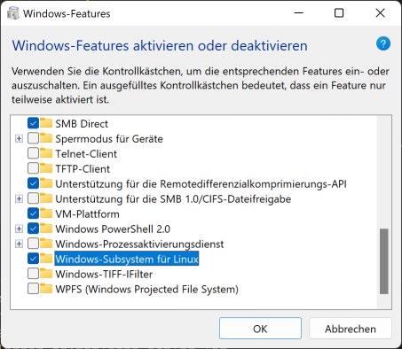
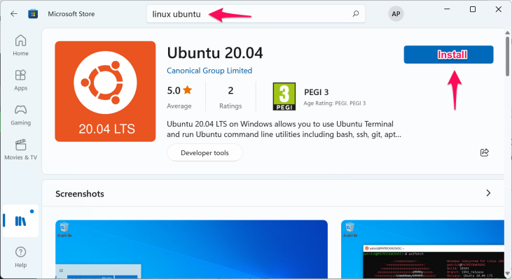
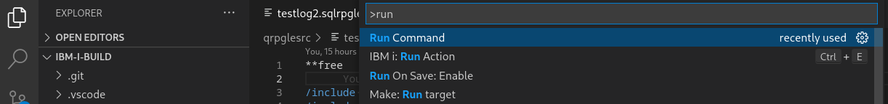
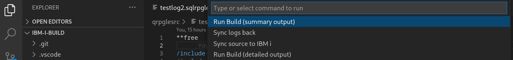
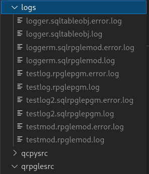

- [Integration in your IDE](#integration-in-your-ide)
  - [Prerequisites](#prerequisites)
    - [On IBM i](#on-ibm-i)
    - [On Linux](#on-linux)
    - [On Windows](#on-windows)
      - [Using WSL (Windows Subsystem for Linux):](#using-wsl-windows-subsystem-for-linux)
      - [Using Cygwin](#using-cygwin)
  - [VSCode](#vscode)
    - [VSCode extensions](#vscode-extensions)
    - [Project settings](#project-settings)
    - [Let's run the build](#lets-run-the-build)
    - [Using ```Code for IBM i```](#using-code-for-ibm-i)


# Integration in your IDE

## Prerequisites

You need some tools on IBM i but also on our local machine:
* ```rsync``` 
  
  To synchronize our sources between local machine an IBM i

* ```make```
  
  This generates the IBM i compile commands


### On IBM i

```sh
yum install rsync make-gnu

===================================================================
 Package        Arch          Version       Repository        Size
===================================================================
Installing:
 make-gnu       ppc64         4.4-1         ibmi-base        520 k
 rsync          ppc64         3.2.3-3       ibmi-base        2.1 M
```

### On Linux
It only depends which package manager you are using (maybe it's already installed):
```sh
sudo yum install     make jq
sudo apt-get install make jq
sudo pacman -S       make jq 
```


### On Windows
```rsync``` is a Unix based utility. So you can't just easily install it on Windows.<br/>
You have 2 options:
* WSL: Windows Subsystem for Linux
  
   Due to performance issues this is the recommended option.

* Cygwin

#### Using WSL (Windows Subsystem for Linux):

1. Open the "Turn Windows features on or off"

2. Choose "Windows Subsystem for Linux" and select "OK"
   
    

3. Enable Virtual Machine feature

     ```dism.exe /online /enable-feature /featurename:VirtualMachinePlatform /all /norestart```

4. Reboot your PC

5. Open the Microsoft Store and search for "Linux Ubuntu" and install it
   
    

6. After installing the Linux distribution "Launch" it.
   
   The first time you may will be asked to set up a user/password for this environment.


You can also do this via PowerShell. You will find a good documentation in the internet for this process if you want to do it in that way.

After this is done you can use ```rsync``` using WSL in the Windows CMD:
```sh
wsl rsync ...
```

#### Using Cygwin

If you prefere Cygwin download and install it with these options:
  * openssh
  * rsync
  * make

After setup open the Cygwin terminal. Add this in your ```~/.bash_profile```:

```sh
export SHELLOPTS
set -o igncr
```

**Be aware:**<br/>
If you want to use make with Cygwin, this will have very bad performance due to architecture and your antivirus scanner.


## VSCode

### VSCode extensions

Therefore I am using the following extensions:

* IBM i Development Pack

    This contains all IBM i extensions, which we want to use for development

* VsCode Action Buttons
* Command Runner
  
    To trigger the sync manually (e.g. if I switch branch) using:<br/> 
    CTRL+SHIFT+P --> Select: Run Command --> Select: Run Build (summary output)

* GitLens and Git Graph (if you are using Git)
* WSL (for Windows only)

    If you use the Windows Subsystem for Linux (WSL) to synchronize the source to our IBM i, you need this extension to make our Windows path linux like.

### Project settings

You can just use the ```.vscode/settings.json``` from this project.<br/>
Rename the ```windows.settings.json``` to ```settings.json``` to get the Windows settings.<br/>
Rename the ```linux.settings.json``` to ```settings.json``` to get the Linux settings.

**Notice for Windows:**<br/>
The standard terminal is set to ```Ubuntu (WSL)``` for this project in the ```.vscode/settings.json```.<br/>
If you prefere Cygwin, you need to change the terminal property there.<br/>
You may need to exit the current Windows terminal in vscode to get the config in action.


### Let's run the build
Use CTRL+SHIFT+P. When you start typing "run command" you should get correct list to select the "Run Command" extension.



Now you will get a list of commands, which are defined in the ```.vscode/settings.json```.



Now the command will be issued:
1. Create build script
2. Sync sources & build script to the IBM i
3. Run build script
4. Sync back the logs

You may get asked for your password.<br/>
You should use key authentication (see the [ssh setup](SSH.md)), so you will get signed in automatically.<br/>
(This is btw. the most secure way to connect to servers. Some Linux admins only allow key authentication.)

```sh
[andreas@Andreas-Linux ibm-i-build]$ make/scripts/cleanup.sh   &&   make/scripts/create_build_script.sh   &&   make/scripts/sync2ibmi.sh   &&   make/scripts/run_build.sh debug;   make/scripts/sync_back_from_ibmi.sh;  make/scripts/git-cache-meta.sh --store


###################################################  
2023-09-03 22:37:42.513 ... cleanup.sh 
################################################### 

###################################################  
2023-09-03 22:37:42.528 ... create_build_script.sh 
################################################### 

summary ===============================================================
summary Build RPG: 2 testlog.rpglepgm testlog2.sqlrpglepgm
summary Build CL: 0 
summary Build DSPF: 0 
summary Build SRVPGM: 2 logger.sqlrpglemod testmod.rpglemod
summary Build DB: 1 logger.sqltableobj
summary ===============================================================
 
 finished creation of build script 

###################################################  
2023-09-03 22:37:43.231 ... sync2ibmi.sh 
################################################### 

 finished sync to academy-test 

###################################################  
2023-09-03 22:37:44.918 ... run_build.sh 
################################################### 

 finished build 

###################################################  
2023-09-03 22:37:50.103 ... sync_back_from_ibmi.sh 
################################################### 

 finished sync back logs and build files 
[andreas@Andreas-Linux ibm-i-build]$ 
```

You should have a logs directory containing the spools of the compiled object and the joblog for each object.



Notice:<br/>
In this project I am using ```make``` only on the PC.<br/>
```make``` generates all the compile commands (in the correct order) which will be written to a script.<br/>
The script will be transfered to the IBM i and executed.<br/>
This is much faster then doing it all on the IBM i.


### Using ```Code for IBM i```
In addition I also use the "Work with Actions" possibility in the ```Code for IBM i``` extension to build the application with gmake.<br/>
In "Command to run" field I use:

```sh
/QOpenSys/pkgs/bin/bash -c "error=*EVENTF lib1=&CURLIB cd ~/myproject; gmake all"
```
The advantage of this is, that I get the compile information directly in my currently opened source.<br/>
So if I am trouble shooting with a source change, this is my choise.<br/>
As far as I know it even works if my opened source is a local one and not opened from IBM i IFS.

I also use the "Work with Actions" to show a list of changed sources which would be compiled

